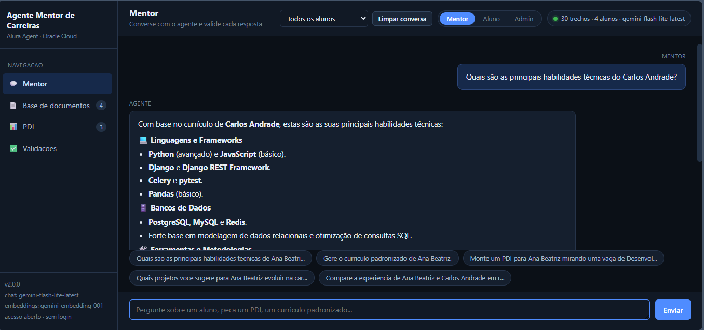

# 🎓 Agente Mentor de Carreiras

Sistema de mentoria de carreira com um agente de IA no centro: o mentor pergunta
em **linguagem natural** sobre os currículos dos alunos, o agente responde com
base nos documentos indexados, e o mentor **valida** cada resposta. Em volta
disso, três telas de apoio — base de documentos, PDI gráfico e painel
administrativo.

Construído para o desafio final **Alura Agent** (curso de Agentes de IA da Alura),
com deploy em **Oracle Cloud Infrastructure**.

> **Stack:** Python 3.11 · FastAPI · Google Gemini (function calling + structured output) · ChromaDB · Docker · OCI Compute

---

## Sumário

- [O problema](#o-problema)
- [O produto](#o-produto)
- [De onde vem este projeto](#de-onde-vem-este-projeto)
- [As telas](#as-telas)
- [Arquitetura](#arquitetura)
- [As 4 ferramentas do agente](#as-4-ferramentas-do-agente)
- [Stack técnica e o porquê de cada escolha](#stack-técnica-e-o-porquê-de-cada-escolha)
- [Estrutura do projeto](#estrutura-do-projeto)
- [Como rodar localmente](#como-rodar-localmente)
- [API](#api)
- [Exemplos reais de perguntas e respostas](#exemplos-reais-de-perguntas-e-respostas)
- [Deploy na OCI](#deploy-na-oci)
- [Testes](#testes)
- [Decisões de projeto](#decisões-de-projeto)
- [Limitações e próximos passos](#limitações-e-próximos-passos)
- [Dados fictícios e LGPD](#dados-fictícios-e-lgpd)

---

## O problema

Numa mentoria de carreira, um mentor acompanha dezenas de alunos ao mesmo tempo.
Toda a informação relevante — experiência, stack, formação, objetivo profissional
— está espalhada em **currículos em PDF**, cada um com um formato diferente. Antes
de qualquer conversa de 1:1, o mentor precisa reler o PDF do aluno, montar
manualmente um plano de estudos e pensar em projetos que façam sentido para o
nível dele. Isso não escala: o tempo vai embora relendo documento em vez de
mentorar.

## O produto

Um sistema interno onde o mentor pergunta em português e o agente responde **com
base nos currículos indexados**, nunca de memória. Quatro capacidades:

| O mentor pede | O agente faz |
|---|---|
| "Quais as habilidades do Carlos?" | Busca semântica no currículo dele e responde citando o que está escrito |
| "Gere o currículo padronizado da Fernanda" | Reescreve o currículo no template único da mentoria |
| "Monte um PDI para o Pedro mirando Full Stack Pleno" | Compara o perfil com a vaga e devolve habilidades atuais, gaps, ações e prazo |
| "Que projetos a Ana pode fazer para virar SDET?" | Sugere 3 projetos de portfólio com objetivo, stack e dificuldade |

Duas regras sustentam o produto:

1. **O que não está no currículo, o agente diz que não está** — em vez de inventar
   uma experiência que o aluno não tem.
2. **O agente propõe, o mentor decide.** Toda resposta pode ser aprovada, marcada
   para ajuste ou rejeitada, com observação. Esse histórico vira o termômetro de
   qualidade do agente.

## De onde vem este projeto

Este não é um problema hipotético inventado para o desafio. Meu Trabalho de
Conclusão de Curso foi na área de educação, sobre o uso de Inteligência
Artificial na geração de currículos e de Planos de Desenvolvimento Individual
(PDI) — e um dos pontos que o próprio trabalho apontava como **trabalho futuro**
era exatamente mesclar IA e humano: usar o modelo como ferramenta de apoio ao
lado de quem acompanha o aluno de perto, e não como uma caixa-preta que decide
sozinha no lugar dele.

Este sistema é essa lacuna colocada em prática. A regra 2 acima — **o agente
propõe, o mentor decide** — não é um detalhe de UX; é o núcleo do que o TCC
identificou como caminho necessário. Por isso a tela de
[Validações](#as-telas) existe como cidadã de primeira classe do produto, e não
como um registro de log escondido: cada resposta do agente passa por um humano
antes de virar decisão sobre a carreira de alguém, e esse histórico de aprovação
é o que dá ao mentor (e a quem for avaliar o sistema depois) visibilidade sobre
a qualidade real do agente ao longo do tempo — não só na hora em que ele
responde, mas depois, quando confrontado com o julgamento de quem conhece o
aluno.

## As telas

O sistema tem três **perfis** — Mentor, Aluno e Admin — que filtram quais telas
aparecem. São **visões da interface, não controle de acesso**: o desafio pede um
agente aberto, sem login, então não há autenticação (ver
[Decisões de projeto](#decisões-de-projeto)).

| Tela | Rota | Perfis | O que faz |
|---|---|---|---|
| **Mentor** | `#/mentor` | Mentor, Admin | Chat com o agente. Cada resposta traz a trilha de ferramentas usadas e os botões de validação. Seletor de aluno em foco personaliza as sugestões. |
| **Base de documentos** | `#/documentos` | todos | Os currículos que alimentam o agente: lista com status de indexação, texto extraído navegável por seção e download do PDF original. É a resposta a "de onde o agente tirou isso?". |
| **PDI** | `#/pdi` | todos | Plano de Desenvolvimento Individual em formato gráfico: medidor de aderência à vaga, barras de habilidades com evidência, gaps com criticidade e nível-alvo, ações ordenadas por esforço e cronograma em linha do tempo. Imprimível em PDF. |
| **Validações** | `#/validacoes` | Mentor, Admin | Histórico do que foi aprovado, mandado ajustar ou rejeitado, com taxa de aprovação e filtros. |
| **Painel admin** | `#/admin` | Admin | Upload de currículos (arrasta e solta, indexa na hora), saúde do índice vetorial (chunks por aluno e por seção), reindexação e configuração efetiva do processo. |

---

## Arquitetura

```
                          Mentor / Aluno / Admin (navegador)
                                       │
                    Frontend SPA (classes ES6, sem build step)
                    Aplicacao → roteador por hash → Tela{Mentor,Documentos,PDI,Validacoes,Admin}
                                       │ fetch
      ─────────────────────────────────┼──────────────────────────────────
                                       ▼
                      FastAPI · app/api/rotas_*.py (routers por domínio)
                                       │ Depends
                                       ▼
                       Camada de serviços (app/services/)
     ┌──────────────┬──────────────┬──────────────┬───────────────┬──────────────┐
     ▼              ▼              ▼              ▼               ▼
ServicoAgente  ServicoDocumentos ServicoIndexacao ServicoPDI  ServicoValidacoes
     │              │                  │              │               │
     ▼              ▼                  ▼              ▼               ▼
 Orquestrador   PDFs em disco    ingestão →      AnalisadorPDI    ColecaoJson
 (function      (data/curriculos) embeddings     (structured      (data/estado)
  calling)                        → ChromaDB      output)
     │                                 │              │
     └────────────┬────────────────────┴──────────────┘
                  ▼
        ┌───────────────────────┐        ┌──────────────────────┐
        │ ChromaDB (embutido)   │        │  Google Gemini       │
        │ chunks + embeddings   │        │  chat · embeddings   │
        │ filtro por aluno      │        └──────────────────────┘
        └───────────────────────┘
```

Tudo roda **dentro de um único container Docker**, numa **instância OCI Compute
(Ampere A1 Flex, Always Free)**, dentro de uma **VCN com subnet pública**. A única
chamada que sai da OCI é para a API do Gemini.

### O fluxo de uma pergunta

1. A tela Mentor envia a pergunta para `POST /api/chat`.
2. O orquestrador manda a pergunta ao Gemini junto com o **schema das 4 ferramentas**
   e a instrução de sistema do mentor.
3. O modelo decide **qual ferramenta chamar** e com quais argumentos — ou responde
   direto, se a pergunta não exigir dados de aluno.
4. O orquestrador **executa a função Python de verdade** (a chamada automática do
   SDK fica desligada de propósito: o loop explícito é o requisito do desafio e é
   o que permite registrar a trilha de execução).
5. O resultado volta ao modelo como `functionResponse`; o passo 3 se repete até o
   modelo escrever a resposta final em linguagem natural.
6. A API devolve a resposta **e a lista de ferramentas usadas** — que a interface
   mostra como chips embaixo de cada mensagem, deixando o raciocínio auditável.
7. O mentor valida a resposta; a avaliação vai para `data/estado/validacoes.json`.

### Ingestão e retrieval

- **Parsing** (`app/ingestion/pdf_parser.py`): `pypdf` extrai o texto página a
  página; o código próprio remove cabeçalho/rodapé repetidos, normaliza espaços e
  descobre o nome do aluno (campo `Nome:`, primeira linha ou nome do arquivo).
- **Chunking** (`app/ingestion/chunking.py`): a divisão respeita a **seção** do
  currículo (Dados pessoais, Resumo, Experiências, Formação, Habilidades, Idiomas).
  Seções longas são subdivididas por linhas inteiras com sobreposição. Cada chunk
  carrega um cabeçalho `Currículo de X | Seção: Y`, o que o torna autocontido para
  o embedding e para o LLM.
- **Embeddings** (`app/retrieval/embeddings.py`): API do Gemini, com `task_type`
  diferente para documento (`RETRIEVAL_DOCUMENT`) e consulta (`RETRIEVAL_QUERY`).
- **Vector store** (`app/retrieval/vector_store.py`): ChromaDB persistido em disco,
  distância cosseno, com **filtro por aluno** no metadado — a busca de um aluno
  nunca traz trecho de outro. Também resolve nome parcial ou com erro de digitação
  ("Carlos" → "Carlos Andrade") antes de filtrar.

### PDI estruturado

A ferramenta `gerar_pdi` devolve markdown para o mentor ler no chat. A tela
gráfica precisa de outra coisa: números e listas tipadas. Em vez de extrair isso
do markdown com regex, o `AnalisadorPDI` pede ao Gemini a saída já estruturada
via `response_schema` — o modelo é obrigado a responder no formato do schema
Pydantic, e o resultado é persistido para não gastar uma chamada de LLM a cada
vez que a tela é aberta.

---

## As 4 ferramentas do agente

Cada uma é uma função Python real, registrada como *tool* do Gemini
(`app/agent/gemini_client.py` declara o schema, `app/agent/tools.py` implementa):

```python
def buscar_info_aluno(nome_aluno: str, pergunta: str) -> str:
    """Busca no vector store (filtrado por aluno) e devolve os trechos recuperados."""

def gerar_curriculo_padronizado(nome_aluno: str) -> str:
    """Reestrutura os dados no template fixo: Dados pessoais / Resumo profissional /
    Experiências / Formação / Habilidades / Idiomas."""

def gerar_pdi(nome_aluno: str, vaga_alvo: str) -> str:
    """Compara o perfil com a vaga-alvo e retorna: Habilidades atuais / Gaps
    identificados / Ações recomendadas / Prazo sugerido."""

def sugerir_projetos(nome_aluno: str, vaga_alvo: str = "") -> str:
    """Sugere 3 projetos práticos, cada um com objetivo, tecnologias e dificuldade."""
```

Há uma diferença proposital entre elas:

- `buscar_info_aluno` é uma ferramenta de **recuperação**: devolve os trechos
  relevantes e deixa a síntese com o modelo orquestrador. Isso economiza uma
  chamada de LLM por pergunta e é o que permite comparar **dois alunos numa única
  resposta** (o modelo chama a ferramenta uma vez para cada e cruza os resultados).
- As outras três são ferramentas de **geração**: montam um prompt especializado
  com o currículo inteiro do aluno e fazem sua própria chamada ao Gemini, porque
  cada uma tem um formato de saída rígido a respeitar.

---

## Stack técnica e o porquê de cada escolha

| Camada | Escolha | Por quê |
|---|---|---|
| Linguagem | Python 3.11+ | Padrão do curso, ecossistema maduro para IA |
| LLM | Google Gemini via SDK `google-genai` | Free tier generoso, *function calling* e *structured output* nativos |
| Embeddings | API de embeddings do Gemini | Mesmo provedor do LLM: dispensa `torch`/`sentence-transformers` e mantém a imagem leve para a VM Always Free |
| Parsing de PDF | `pypdf` | Leve, sem dependência nativa complexa (importa numa VM ARM sem dor) |
| Vector store | `ChromaDB` persistido em disco | Roda embutido no processo: **zero serviço externo** para provisionar na OCI |
| Estado (PDIs, validações) | Arquivos JSON com escrita atômica | Dezenas de registros, escritos raramente: um banco seria peso morto no container |
| Backend | `FastAPI` + routers por domínio | Assíncrono, leve, OpenAPI de graça, injeção de dependência nativa |
| Frontend | Classes ES6 + módulos nativos, **sem build step** | Sem `npm`, sem bundler, sem `node_modules` na VM: o FastAPI serve os arquivos direto |
| Gráficos | SVG escrito à mão (`js/graficos.js`) | A instância serve a página sem depender de CDN — e são 4 tipos de gráfico, não uma biblioteca inteira |
| Empacotamento | Docker multi-stage, `linux/amd64` + `linux/arm64` | A instância Ampere A1 é **ARM**: imagem só x86 não roda lá |
| Config | Variáveis de ambiente via `.env` | A chave da API nunca entra no repositório nem na imagem |

### Modelos e cota do free tier

O app **escolhe o modelo sozinho** e se adapta a duas realidades que quebram
projetos parecidos:

**1. O Google aposenta nomes de modelo.** Em agosto de 2026 o `gemini-2.5-flash`
passou a responder `404 — no longer available to new users`. A lista de
preferência em `app/config.py` começa pelos modelos atuais e mantém os antigos
como rede de segurança; `scripts/checar_modelos.py`.

**2. A cota gratuita é diária E por modelo.** Medido na prática: cada modelo flash
dá cerca de **20 requisições por dia**. Uma demo pública esgota isso em poucas
conversas. Por isso, ao receber um `429` de cota diária, o agente **marca aquele
modelo como esgotado e desce automaticamente para o próximo da lista**, somando a
cota de vários modelos. O rodapé da interface mostra qual está em uso no momento.

Para fixar um modelo específico, preencha `GEMINI_MODEL` e
`GEMINI_EMBEDDING_MODEL` no `.env`.

> **Sobre embeddings:** o `gemini-embedding-001` vem antes do mais novo
> `gemini-embedding-2` de propósito — o `-2` ignora o envio em lote e devolve
> **um único vetor** para N textos, sem sinalizar erro. O código confere o
> tamanho do retorno e cai para envio um-a-um quando isso acontece; sem essa
> checagem, os chunks receberiam vetores desalinhados e a busca inteira ficaria
> errada em silêncio.

---

## Estrutura do projeto

```
.
├── app/
│   ├── main.py                       # monta a aplicação: middlewares, routers, estáticos
│   ├── config.py                     # configuração central via variáveis de ambiente
│   ├── api/                          # camada HTTP: um router por domínio
│   │   ├── dependencias.py           # injeção de dependência (serviços como singleton)
│   │   ├── rotas_agente.py           # /api/chat, /api/status, /health
│   │   ├── rotas_documentos.py       # /api/documentos, /api/alunos
│   │   ├── rotas_pdi.py              # /api/pdi
│   │   ├── rotas_validacoes.py       # /api/validacoes
│   │   └── rotas_admin.py            # /api/admin
│   ├── services/                     # regra de negócio, em classes
│   │   ├── agente.py                 # ServicoAgente: fachada do orquestrador
│   │   ├── documentos.py             # ServicoDocumentos: PDFs (upload, leitura, remoção)
│   │   ├── indexacao.py              # ServicoIndexacao: pipeline e saúde do índice
│   │   ├── pdi.py                    # ServicoPDI: gera, cacheia e versiona PDIs
│   │   └── validacoes.py             # ServicoValidacoes: avaliações do mentor
│   ├── agent/
│   │   ├── gemini_client.py          # client Gemini, escolha de modelo, schema das tools
│   │   ├── tools.py                  # implementação das 4 ferramentas
│   │   ├── orchestrator.py           # loop de function calling
│   │   └── analise.py                # AnalisadorPDI: PDI estruturado (response_schema)
│   ├── ingestion/
│   │   ├── pdf_parser.py             # PDF → texto limpo
│   │   └── chunking.py               # texto → chunks com metadados (aluno, seção)
│   ├── retrieval/
│   │   ├── embeddings.py             # embeddings via Gemini
│   │   └── vector_store.py           # ChromaDB: indexar, buscar, filtrar, estatísticas
│   ├── storage/
│   │   └── repositorio_json.py       # RepositorioJson / ColecaoJson (escrita atômica)
│   ├── models/
│   │   └── schemas.py                # contratos Pydantic de toda a API
│   └── static/                       # frontend, servido pelo próprio FastAPI
│       ├── index.html
│       ├── css/estilo.css            # design system (tokens, componentes, responsivo, impressão)
│       └── js/
│           ├── app.js                # Aplicacao: navegação, roteador, status
│           ├── api.js                # ApiClient: um método por endpoint
│           ├── estado.js             # Estado compartilhado + eventos
│           ├── nucleo.js             # DOM, markdown, toasts, modais, formatação
│           ├── graficos.js           # Graficos: medidor, barras, gaps, rosca, cronograma
│           └── telas/                # uma classe por tela, estendendo Tela
│               ├── base.js  mentor.js  documentos.js  pdi.js  validacoes.js  admin.js
├── data/
│   ├── curriculos/                   # 4 currículos fictícios em PDF
│   ├── chroma/                       # índice persistido (fora do Git)
│   └── estado/                       # PDIs e validações (fora do Git)
├── scripts/
│   ├── gerar_curriculos_exemplo.py   # gera os PDFs fictícios
│   ├── indexar_curriculos.py         # pipeline de ingestão pela linha de comando
│   └── rodar_testes.py               # roda o roteiro e injeta os exemplos neste README
├── deploy/README-OCI.md              # passo a passo do provisionamento na OCI
├── tests/test_agent_manual.md        # roteiro de testes manuais (agente + telas)
├── Dockerfile · docker-compose.yml · requirements.txt · .env.example
└── README.md
```

---

## Como rodar localmente

### Opção 1 — Docker (um comando)

```bash
cp .env.example .env      # preencha GEMINI_API_KEY
docker compose up -d
```

Abra <http://localhost:8000>. Na primeira subida o container detecta que o índice
está vazio, lê os PDFs, gera os embeddings e grava o ChromaDB automaticamente —
acompanhe com `docker compose logs -f`.

### Opção 2 — Python direto

```bash
python -m venv .venv
source .venv/bin/activate        # Windows: .venv\Scripts\activate
pip install -r requirements.txt

cp .env.example .env             # preencha GEMINI_API_KEY

python scripts/gerar_curriculos_exemplo.py   # gera os 4 PDFs fictícios
python scripts/indexar_curriculos.py         # PDF → chunks → embeddings → ChromaDB

uvicorn app.main:app --reload --port 8000
```

Você precisa de uma chave do Gemini: <https://aistudio.google.com/apikey>.

---

## API

Documentação interativa completa em `/docs` (Swagger, gerado pelo FastAPI).

| Método | Rota | Função |
|---|---|---|
| GET | `/` | Interface do sistema |
| GET | `/health` | Health check (usado pelo Docker) |
| GET | `/api/status` | Diagnóstico: chave, chunks, alunos, contadores, modelos |
| POST | `/api/chat` | Pergunta ao agente (`{"pergunta": "...", "historico": []}`) |
| GET | `/api/documentos` | Currículos da base, com status de indexação |
| GET | `/api/documentos/{arquivo}` | Texto extraído + seções identificadas |
| GET | `/api/documentos/{arquivo}/download` | PDF original |
| POST | `/api/documentos` | Upload de currículo (multipart) — grava e indexa |
| POST | `/api/documentos/{arquivo}/indexar` | Reindexa um currículo |
| DELETE | `/api/documentos/{arquivo}` | Remove PDF + chunks + PDIs do aluno |
| GET | `/api/alunos` | Alunos indexados, com chunks, seções e nº de PDIs |
| GET | `/api/alunos/{nome}` | Um aluno (aceita nome parcial) |
| GET | `/api/alunos/{nome}/curriculo` | Currículo remontado do índice |
| GET | `/api/pdi` | PDIs gerados |
| POST | `/api/pdi` | Gera PDI estruturado (usa cache; `forcar_regeracao` ignora) |
| GET/DELETE | `/api/pdi/{id}` | Abre / exclui um PDI |
| GET | `/api/validacoes` | Histórico de validações (filtra por veredito e aluno) |
| GET | `/api/validacoes/resumo` | Contagem por veredito |
| POST | `/api/validacoes` | Registra a avaliação de uma resposta |
| PATCH/DELETE | `/api/validacoes/{id}` | Atualiza / remove uma validação |
| GET | `/api/admin/indice` | Estatísticas do vector store |
| POST | `/api/admin/reindexar` | Apaga a coleção e reprocessa todos os PDFs |
| GET | `/api/admin/configuracao` | Configuração efetiva (chave mascarada) |

Exemplo via `curl`:

```bash
curl -s -X POST http://localhost:8000/api/chat -H "Content-Type: application/json" -d '{"pergunta":"Quais as habilidades do Carlos Andrade?"}'
```

---

## Exemplos reais de perguntas e respostas

Rode `python scripts/rodar_testes.py`: ele executa os 5 casos do roteiro contra o
agente de verdade e **substitui esta seção pelas respostas reais**, com as
ferramentas que o modelo escolheu em cada uma.

<!-- INICIO_EXEMPLOS -->

> Respostas reais do agente, capturadas em 19/08/2026 as 22:20 com o modelo `gemini-3.5-flash`.
> Reproduza com `python scripts/rodar_testes.py`.

### 1. Quais sao as principais habilidades tecnicas do Carlos Andrade?

**Ferramentas acionadas pelo agente:**

- `buscar_info_aluno(pergunta='Quais sao as principais habilidades tecnicas do Carlos Andrade?', nome_aluno='Carlos Andrade')` — 418 ms

**Resposta:**

> Com base no currículo de **Carlos Andrade**, as suas principais habilidades técnicas são:
>
> ### 💻 Linguagens e Frameworks
> *   **Python (Avançado):** Foco em desenvolvimento backend, APIs REST e sistemas transacionais. Tem experiência com Python 3.10 e migração de sistemas legados (Python 2.7).
> *   **SQL (Avançado):** Forte em modelagem de dados relacionais e otimização de consultas complexas.
> *   **JavaScript (Básico).**
> *   **Frameworks e Bibliotecas:** Django, Django REST Framework, Celery, pytest e Pandas (básico).
>
> ### 🗄️ Bancos de Dados
> *   PostgreSQL, MySQL e Redis.
>
> ### 🛠️ Ferramentas e Metodologias
> *   **Ferramentas:** Git, GitHub Actions (uso básico), Linux e Postman.
> *   **Metodologias:** Scrum, *code review* e TDD parcial (testes automatizados).
>
> ---
>
> ### ⚠️ Observações importantes para o Mentor (Gaps de Infraestrutura):
> Se o objetivo do Carlos for evoluir para uma posição Sênior (como mencionado em seu objetivo de carreira), vale notar que ele:
> *   **Não tem experiência prática com Cloud:** Nunca provisionou recursos em AWS, Azure, GCP ou OCI (os deploys que acompanhou eram feitos por um time de infraestrutura separado em servidores *on-premise*).
> *   **Não tem experiência com Docker em produção.**

*Tempo total: 6.5s*

### 2. Gere o curriculo padronizado da Fernanda Lima.

**Ferramentas acionadas pelo agente:**

- `gerar_curriculo_padronizado(nome_aluno='Fernanda Lima')` — 36821 ms

**Resposta:**

> Aqui está o currículo padronizado da **Fernanda Lima**, formatado no modelo da mentoria:
>
> ---
>
> ## Dados pessoais
>
> * **Nome:** Fernanda Lima
> * **E-mail:** fernanda.lima@exemplo.com.br
> * **Telefone:** (31) 90000-0002
> * **Cidade:** Belo Horizonte - MG (Disponibilidade para modelo híbrido)
> * **LinkedIn:** linkedin.com/in/fernanda-lima-exemplo
>
> ## Resumo profissional
>
> Analista de dados com 4 anos de experiência em construção de indicadores e dashboards corporativos, com domínio de SQL analítico e Power BI. Atualmente em transição para Ciência de Dados, cursa pós-graduação na área e estuda Python (Pandas) para análises exploratórias básicas. Tem como objetivo de carreira atuar como Cientista de Dados Júnior.
>
> ## Experiências profissionais
>
> **Analista de Dados Pleno** — *Rede Varejo Colina* (Ago/2022 - Atual)
> * Construção e manutenção de 12 dashboards em Power BI para as áreas comercial, logística e financeira.
> * Escrita de consultas SQL analíticas em SQL Server (CTEs, window functions) sobre um data warehouse de 2 TB.
> * Modelagem dimensional (*star schema*) das áreas de vendas e estoque junto ao time de engenharia de dados.
> * Análise exploratória de dados de vendas em Python com Pandas para identificar sazonalidade por região.
> * Treinamento de usuários de negócio no autoatendimento dos painéis.
>
> **Analista de Dados Júnior** — *Consultoria Prisma Analytics* (Fev/2021 - Jul/2022)
> * Extração e tratamento de dados de múltiplas fontes (Excel, CSV, APIs) para relatórios de clientes.
> * Automação de relatórios recorrentes que antes eram montados manualmente em planilhas.
> * Apresentação de resultados para clientes não técnicos.
>
> ## Formação acadêmica
>
> * **Pós-graduação (MBA) em Ciência de Dados** — *Instituto Exemplo* (Em andamento, previsão de conclusão em 2026)
> * **Bacharelado em Estatística** — *Universidade Exemplo de Minas Gerais* (Concluído em 2020)
> * **Curso livre: Python para Data Science** — *Alura* (Concluído em 2024)
>
> ## Habilidades técnicas
>
> * **Linguagens:** SQL (avançado), Python (básico), DAX (intermediário), R (noções)
> * **Bancos de dados:** SQL Server, PostgreSQL, BigQuery (noções)
> * **Visualização:** Power BI (avançado), Excel avançado, Looker Studio (básico)
> * **Bibliotecas Python:** Pandas (básico), Matplotlib (básico). *Sem experiência com scikit-learn.*
> * **Estatística:** Estatística descritiva, testes de hipótese, regressão linear (base acadêmica)
> * **Cloud e engenharia:** *Sem experiência com pipelines em nuvem, Airflow, Spark ou versionamento de modelos.*
>
> ## Idiomas
>
> * **Português:** Nativo
> * **Inglês:** Avançado (leitura, escrita e reuniões)

*Tempo total: 57.6s*

### 3. Monte um PDI para o Pedro Souza mirando uma vaga de Desenvolvedor Full Stack Pleno, com React e Node.js.

**Ferramentas acionadas pelo agente:**

- `gerar_pdi(vaga_alvo='Desenvolvedor Full Stack Pleno, com React e Node.js', nome_aluno='Pedro Souza')` — 40201 ms

**Resposta:**

> Aqui está o **Plano de Desenvolvimento Individual (PDI)** estruturado para o **Pedro Souza**, focado na transição de Desenvolvedor Frontend Júnior para **Desenvolvedor Full Stack Pleno (React e Node.js)**. 
>
> Este plano foi desenhado considerando que ele já possui uma base sólida e prática em Frontend (React/TypeScript), mas precisa construir sua maturidade no ecossistema Backend do zero.
>
> ---
>
> # Plano de Desenvolvimento Individual (PDI)
> **Aluno:** Pedro Souza  
> **Objetivo de Carreira:** Desenvolvedor Full Stack Pleno (React/Node.js)  
> **Prazo Estimado:** 6 meses (dedicação paralela ao trabalho atual)
>
> ---
>
> ## 1. Perfil Atual (Habilidades Consolidadas)
> *   **Frontend SPA com React & TypeScript:** Domínio de React 18, gerenciamento de estado, rotas e tipagem estática (experiência prática na Agência Pixel Sul).
> *   **Otimização de Performance (Core Web Vitals):** Histórico comprovado de otimização (redução de LCP de 4,1s para 1,8s usando *code splitting* e *lazy loading*).
> *   **Testes no Frontend:** Criação de testes unitários e de componentes com Jest e React Testing Library.
> *   **Design Systems e Acessibilidade:** Criação de interfaces responsivas e acessíveis (Styled Components, Storybook, WCAG 2.1 AA).
> *   **Formação Acadêmica:** Tecnólogo em Análise e Desenvolvimento de Sistemas (concluído em 2023).
>
> ---
>
> ## 2. Gaps Identificados (Foco de Desenvolvimento)
> Para atingir o nível Pleno como Full Stack, Pedro precisa suprir a falta de experiência prática no Backend:
>
> 1.  **Desenvolvimento de APIs REST com Node.js e Express/NestJS (Crítico):** Aprender a estruturar servidores, rotas, middlewares e controllers de forma autônoma.
> 2.  **Modelagem e Persistência de Dados (Crítico):** Domínio de bancos de dados relacionais (PostgreSQL/MySQL) e uso de ORMs (Prisma ou Sequelize).
> 3.  **Segurança e Autenticação (Alto):** Implementação de fluxos de login seguros usando criptografia de senhas (bcrypt) e tokens (JWT).
> 4.  **Testes Automatizados no Backend (Médio):** Criação de testes de integração e unitários para garantir a estabilidade das regras de negócio no servidor.
> 5.  **Deploy e CI/CD Full Stack (Baixo):** Capacidade de colocar a aplicação completa no ar (Vercel para Frontend, Render/Railway para Backend e Banco de Dados).
>
> ---
>
> ## 3. Plano de Ação Recomendado
>
> *   **Ação 1: Construção da Base Backend (Node.js + Express)**
>     *   *O que fazer:* Realizar um curso prático de Node.js com TypeScript e Express. Criar uma API REST estruturada do zero, aplicando boas práticas de arquitetura de pastas.
> *   **Ação 2: Integração com Banco de Dados**
>     *   *O que fazer:* Integrar um banco de dados PostgreSQL à API criada. Utilizar o **Prisma ORM** para gerenciar as tabelas (migrations) e realizar operações de CRUD completas.
> *   **Ação 3: Camada de Segurança**
>     *   *O que fazer:* Implementar autenticação JWT na API. Proteger rotas específicas e garantir que as senhas dos usuários sejam salvas com hash seguro (`bcrypt`).
> *   **Ação 4: Testes de Integração**
>     *   *O que fazer:* Escrever testes automatizados para as rotas da API utilizando **Jest** e **Supertest**, buscando cobrir cenários de sucesso e erro (mínimo de 80% de cobertura).
> *   **Ação 5: Projeto Integrado (Full Stack) e Deploy**
>     *   *O que fazer:* Desenvolver um projeto autoral completo (ex: gerenciador de tarefas ou sistema de agendamentos) conectando o frontend em React (usando React Query) à API Node.js. Fazer o deploy de ambas as partes em produção.
>
> ---
>
> ## 4. Cronograma Sugerido (6 meses)
>
> ### 📅 Mês 1 e 2: Fundamentos de Node.js, Express e Banco de Dados
> *   **Foco:** Entender o fluxo de requisição/resposta, protocolo HTTP, criação de rotas e persistência de dados.
> *   **Entregável:** Uma API REST funcional em Node.js (TypeScript) integrada ao PostgreSQL via Prisma ORM, realizando operações de CRUD.
>
> ### 📅 Mês 3 e 4: Segurança, Testes e Robustez
> *   **Foco:** Deixar a API segura, validada e testada contra falhas.
> *   **Entregável:** Implementação de autenticação JWT, tratamento global de erros, validação de dados de entrada (com Zod ou Yup) e cobertura de testes de integração com Jest/Supertest.
>
> ### 📅 Mês 5 e 6: Integração Full Stack, Deploy e Portfólio
> *   **Foco:** Conectar as duas pontas (React + Node.js) e preparar a transição de carreira.
> *   **Entregável:** 
>     *   Projeto Full Stack completo publicado no GitHub (com README detalhado) e deploy ativo em produção (Vercel + Railway/Render).
>     *   Atualização do LinkedIn e currículo destacando as novas habilidades em Node.js.
>
> ---
>
> ## 💡 Dica para o Mentor (Conversa 1:1)
> Incentive o Pedro a tentar **buscar demandas de backend dentro da própria empresa atual** (Agência Pixel Sul) à medida que ele for avançando no Mês 3. Conseguir colocar a mão no código de produção do backend deles, mesmo que em tarefas simples, vai acelerar drasticamente a maturidade dele para o nível Pleno.

*Tempo total: 266.9s*

### 4. Quais projetos voce sugere para a Ana Beatriz evoluir para SDET?

**Ferramentas acionadas pelo agente:**

- `sugerir_projetos(nome_aluno='Ana Beatriz', vaga_alvo='SDET')` — 30808 ms

**Resposta:**

> Aqui estão as sugestões de projetos práticos de portfólio para a **Ana Beatriz** focar na transição para o perfil de **SDET**. 
>
> Esses projetos foram desenhados para aproveitar a base que ela já possui (como Java) e fechar lacunas cruciais de mercado (como automação de APIs, CI/CD, Docker, testes de contrato e performance).
>
> ---
>
> ### 1. API-Health-Secure: Automação de Testes de API de Agendamento Hospitalar
> * **Objetivo:** Fecha o gap de falta de experiência em automação de APIs (atualmente ela realiza testes manuais com Postman). Prova que ela domina o protocolo HTTP, manipulação de payloads dinâmicos em Java (POJOs), validação de schemas JSON e asserções avançadas de back-end.
> * **Tecnologias:** Java, RestAssured, JUnit 5 (evoluindo do TestNG), Jackson/Lombok (para serialização/deserialização de dados), Java-Faker (geração de dados dinâmicos) e Maven.
> * **Nível de Dificuldade:** Intermediário | **Esforço estimado:** 25 horas.
> * **Entregável:** Repositório no GitHub com uma suíte de testes estruturada contra uma API de saúde (pode ser mockada com WireMock ou uma API pública). O código deve usar o padrão de *Request/Response Specifications* do RestAssured, conter validações de JSON Schema, cobertura de verbos HTTP (GET, POST, PUT, DELETE) e um `README.md` detalhado explicando como rodar os testes e analisar os resultados.
>
> ---
>
> ### 2. Pipeline-Clinica-CI: Containerização e Pipeline de CI/CD para Regressão de Saúde
> * **Objetivo:** Elimina as lacunas de Docker e CI/CD (GitHub Actions). Prova que ela sabe integrar testes automatizados no fluxo de deploy contínuo (DevOps), garantindo execuções isoladas, paralelas e independentes de ambiente ("funciona na minha máquina").
> * **Tecnologias:** Selenium WebDriver em modo Headless, RestAssured (consolidando o projeto anterior), Docker e Docker Compose, GitHub Actions e Allure Reports.
> * **Nível de Dificuldade:** Intermediário para Avançado | **Esforço estimado:** 40 horas.
> * **Entregável:** Repositório no GitHub com um fluxo de CI configurado via `.github/workflows/main.yml`. O pipeline deve rodar a cada *push* e realizar:
>   1. Subida de um container Docker com a aplicação web/API de prontuário eletrônico.
>   2. Subida de um container com Selenium Grid (Chrome/Firefox headless).
>   3. Execução paralela da suíte de testes híbrida (UI com Selenium + API com RestAssured).
>   4. Geração e publicação automática do relatório Allure Reports no GitHub Pages.
>
> ---
>
> ### 3. Telemed-Performance-Contract: Testes de Contrato e Carga em Microsserviços de Telemedicina
> * **Objetivo:** Consolida o perfil de SDET ao fechar os gaps de testes de performance e testes de contrato. Prova a capacidade de garantir a resiliência e a integridade de sistemas distribuídos (microsserviços) sob alta carga de acessos.
> * **Tecnologias:** k6 (ferramenta moderna de performance baseada em JS), Pact framework com Java (testes de contrato) e Docker.
> * **Nível de Dificuldade:** Avançado | **Esforço estimado:** 50 horas.
> * **Entregável:** Repositório contendo duas frentes de validação para um sistema de Telemedicina:
>   1. **Testes de Contrato:** Arquivos de pacto gerados em Java validando a integração entre o microsserviço de "Agendamento" (Consumer) e o de "Notificação de Pacientes" (Provider).
>   2. **Testes de Performance:** Scripts em k6 simulando cenários de carga (médicos e pacientes entrando em salas virtuais simultaneamente), testes de estresse e testes de pico (*Spike Tests*). Deve incluir a definição de *Thresholds* (SLAs de erro < 1% e tempo de resposta < 500ms) e um relatório técnico no `README.md` analisando o comportamento do sistema sob carga.
>
> ---
>
> ### Dica para a 1:1 com a Ana:
> Sugiro orientá-la a começar pelo **Projeto 1 (APIs)**, que é o passo mais imediato para quem já programa em Java mas ainda testa APIs manualmente. Assim que ela dominar o RestAssured, o **Projeto 2** entra como a evolução natural para colocar essa automação em uma esteira de CI/CD.

*Tempo total: 37.2s*

### 5. Compare a experiencia de Carlos e Fernanda em relacao a dados.

**Ferramentas acionadas pelo agente:**

- `buscar_info_aluno(pergunta='Qual é a experiência, histórico profissional e habilidades de Carlos na área de dados?', nome_aluno='Carlos')` — 438 ms
- `buscar_info_aluno(nome_aluno='Fernanda', pergunta='Qual é a experiência, histórico profissional e habilidades de Fernanda na área de dados?')` — 681 ms

**Resposta:**

> Com base nos currículos de **Carlos Andrade** e **Fernanda Lima**, aqui está uma comparação detalhada da experiência de ambos na área de dados. 
>
> Embora ambos possuam excelente domínio de SQL, eles aplicam esse conhecimento em contextos completamente diferentes: Carlos tem um perfil voltado para o **desenvolvimento backend e engenharia de software (dados transacionais)**, enquanto Fernanda tem foco em **análise de dados e business intelligence (dados analíticos)**.
>
> ---
>
> ### 1. Foco de Atuação e Perfil Geral
> * **Carlos Andrade (Desenvolvedor Backend Pleno):** Atua com foco em sistemas transacionais (OLTP). Sua experiência com dados está ligada à performance de APIs, modelagem relacional para persistência de dados de aplicações e otimização de consultas para rotinas de sistemas.
> * **Fernanda Lima (Analista de Dados Pleno):** Atua diretamente na área de dados há 4 anos, focada em inteligência de negócios (BI), geração de insights, relatórios gerenciais e análise exploratória (OLAP). Atualmente, está em transição de carreira para Ciência de Dados.
>
> ### 2. Domínio de SQL e Modelagem de Dados
> * **Carlos Andrade (SQL Avançado):**
>   * **Foco:** Modelagem relacional e otimização de banco de dados para aplicações.
>   * **Experiência prática:** Escrita de *migrations* em PostgreSQL, criação de índices compostos e reescrita de consultas (usando `select_related` no Django) que reduziram em 60% o tempo de rotinas de fechamento mensal. Também possui experiência com consultas complexas em MySQL para relatórios financeiros.
>   * **Bancos de dados:** PostgreSQL, MySQL e Redis (NoSQL para cache/filas).
> * **Fernanda Lima (SQL Avançado):**
>   * **Foco:** SQL analítico para manipulação de grandes volumes de dados e modelagem dimensional.
>   * **Experiência prática:** Escrita de consultas analíticas complexas (utilizando CTEs e *window functions*) sobre um Data Warehouse de 2 TB (SQL Server). Atuou na modelagem dimensional (*star schema*) para as áreas de vendas e estoque junto ao time de engenharia de dados.
>   * **Bancos de dados:** SQL Server, PostgreSQL e noções de BigQuery.
>
> ### 3. Uso de Python e Bibliotecas de Dados
> * **Carlos Andrade (Python Avançado):**
>   * Domina a linguagem para desenvolvimento de software (Django, Celery, pytest).
>   * No contexto de dados, possui conhecimento **básico em Pandas**, mas seu foco principal é a lógica de negócios no backend e automação de rotinas com scripts.
> * **Fernanda Lima (Python Básico):**
>   * Utiliza a linguagem de forma focada em análise de dados.
>   * Realiza análises exploratórias de vendas utilizando **Pandas** e **Matplotlib** para identificar sazonalidades. 
>   * Não possui experiência com bibliotecas de Machine Learning (como *scikit-learn*) e nunca colocou modelos em produção, embora esteja cursando um MBA em Ciência de Dados para evoluir nesse ponto.
>
> ### 4. Visualização de Dados e Ferramentas de BI
> * **Carlos Andrade:** Não possui experiência descrita com ferramentas de BI ou visualização de dados (como Power BI ou Looker). Seu foco de entrega de dados é via APIs REST ou relatórios gerados por scripts.
> * **Fernanda Lima (Power BI Avançado):**
>   * Especialista em visualização. Construiu e mantém 12 dashboards corporativos em Power BI para as áreas comercial, logística e financeira.
>   * Domina **DAX (intermediário)** e Excel Avançado, além de ter noções de Looker Studio. Tem forte experiência em traduzir dados para áreas de negócios e treinar usuários em autoatendimento.
>
> ### 5. Formação Acadêmica Relacionada
> * **Carlos Andrade:** Bacharel em Ciência da Computação (2021). Seu aprendizado em dados é mais voltado à engenharia de software e cursos livres de SQL/Modelagem.
> * **Fernanda Lima:** Bacharel em Estatística (2020) e pós-graduanda (MBA) em Ciência de Dados (previsão 2026). Possui forte base teórica em estatística descritiva, testes de hipótese e regressão linear.
>
> ---
>
> ### Resumo para o Mentor (Direcionamento de Conversa)
> * **Use o Carlos se o objetivo for:** Discutir otimização de banco de dados de produção, modelagem de tabelas para novos recursos de sistemas, índices, performance de queries e integração de bancos relacionais com APIs.
> * **Use a Fernanda se o objetivo for:** Discutir estruturação de Data Warehouses, modelagem dimensional (*star schema*), criação de métricas de negócios (KPIs), relatórios gerenciais e transição para a carreira de Ciência de Dados (focando nos gaps de Python e Machine Learning).

*Tempo total: 14.2s*

<!-- FIM_EXEMPLOS -->

---

## Deploy na OCI

O passo a passo completo, com console, `cloud-init`, firewall e diagnóstico de
problemas, está em **[`deploy/README-OCI.md`](deploy/README-OCI.md)**.

### Serviços usados e o racional

| Serviço OCI | Uso | Por que este e não outro |
|---|---|---|
| **Compute** — `VM.Standard.A1.Flex`, 2 OCPU / 12 GB, Ubuntu 22.04 | Roda o container | É o shape Always Free mais generoso. Como toda a stack cabe num container só (API + frontend + vector store embutido), uma VM resolve — sem custo e sem orquestrador |
| **VCN + subnet pública + Internet Gateway** | Dá IP público alcançável à VM | Requisito do desafio: o agente precisa estar acessível publicamente |
| **Security List** (ingress TCP 8000 de `0.0.0.0/0`) | Libera a porta da aplicação | Acesso aberto, sem login, por definição do desafio |

**Por que não OKE, Container Instances ou Functions?** O desafio pede um deploy
funcional e público, não escala. Kubernetes seria infraestrutura demais para um
container; Functions não combina com um processo que mantém índice vetorial e
estado em disco. Compute + Docker é o caminho mais curto entre o código e um IP
público — e cabe inteiro no Always Free.

**Detalhes que economizam tempo no deploy:**

- A imagem é buildada para `linux/arm64` (a Ampere A1 é ARM). Buildando na própria
  VM isso é automático; se preferir registry, use
  `docker buildx build --platform linux/amd64,linux/arm64`.
- A imagem Ubuntu da OCI vem com regras de `iptables` que bloqueiam a porta mesmo
  com a Security List liberada — é preciso liberar também dentro da VM
  ([passo 4a](deploy/README-OCI.md#4a-liberar-a-porta-8000-no-firewall-da-própria-vm)).
- A `GEMINI_API_KEY` vive só no `.env` **dentro da instância**: nunca no repositório,
  nunca na imagem.
- Índice e estado ficam em volumes Docker (`chroma` e `estado`), então
  `docker compose down && up` não perde os PDIs nem as validações.

### Agente rodando na OCI

**[Abrir o agente ao vivo](http://140.238.178.104:8000)** — `http://140.238.178.104:8000`



Print da tela **Mentor** rodando na instância `VM.Standard.A1.Flex` (2 OCPU / 12 GB)
na Ampere A1. A resposta veio do agente de verdade, com function calling acionando
`buscar_info_aluno` sobre o currículo do Carlos Andrade — o rodapé mostra o índice
ativo (30 trechos, 4 alunos) e o modelo em uso no momento
(`gemini-flash-lite-latest`), resultado da troca automática de modelo quando a
cota diária gratuita de um modelo se esgota (ver
[Modelos e cota do free tier](#modelos-e-cota-do-free-tier)).

> Se o link acima estiver fora do ar, o print e os 5 exemplos de pergunta e
> resposta reais logo abaixo documentam a execução real na OCI.

---

## Testes

O roteiro está em [`tests/test_agent_manual.md`](tests/test_agent_manual.md),
dividido em dois blocos: **A. o agente** (5 casos principais, um por ferramenta,
mais 5 de borda) e **B. o sistema** (perfis, documentos, upload, PDI gráfico,
validações e degradação sem chave).

```bash
python scripts/rodar_testes.py               # 5 casos principais do agente
python scripts/rodar_testes.py --com-bordas  # inclui os casos de borda
```

A transcrição completa fica em `tests/resultados_execucao.md`.

---

## Decisões de projeto

- **Perfis sem autenticação.** O desafio exige acesso aberto, sem login. Mentor,
  Aluno e Admin são **visões da interface** — mudam o que aparece, não o que é
  permitido. Num uso real com dados de verdade, isso viraria autenticação de fato
  (ver [LGPD](#dados-fictícios-e-lgpd)).
- **Function calling manual, não automático.** O SDK do Gemini sabe executar as
  funções sozinho, mas o loop explícito em `orchestrator.py` é o requisito do
  desafio — e é o que permite mostrar ao mentor **qual ferramenta foi usada** em
  cada resposta.
- **Camada de serviços entre rotas e infraestrutura.** As rotas só traduzem HTTP;
  a regra vive em classes de serviço. É o que permite o mesmo `ServicoIndexacao`
  atender o script de linha de comando, a auto-indexação da subida e o painel
  admin sem os três divergirem.
- **Structured output para o PDI gráfico.** Pedir JSON com `response_schema` é mais
  confiável do que extrair números de um markdown com regex.
- **PDI cacheado por aluno + vaga.** Gerar custa uma chamada de LLM de vários
  segundos; a tela é navegada muitas vezes. Regerar é uma ação explícita, e
  substitui a versão anterior em vez de acumular lixo.
- **Chunk por seção, não por tamanho fixo.** Currículo é um documento naturalmente
  seccionado; respeitar isso mantém cada chunk coeso e dá um metadado útil para
  filtrar e citar a fonte.
- **Filtro por aluno no vector store.** A busca de um aluno nunca traz trecho de
  outro, o que elimina a classe de erro mais perigosa aqui: atribuir a experiência
  de uma pessoa a outra.
- **Frontend sem build step.** Classes ES6 e módulos nativos do browser. Não há
  `npm install` no deploy, nem `node_modules` na imagem — o FastAPI serve os
  arquivos direto e o container continua com uma única linguagem dentro.
- **Auto-indexação na subida.** Se o índice está vazio e há chave configurada, o
  app indexa sozinho ao subir. É o que faz `docker compose up` funcionar de
  primeira na OCI, sem passo manual.
- **Degradação com aviso claro.** Sem chave ou sem índice, a aplicação sobe do
  mesmo jeito, a base de documentos continua navegável e o `/api/status` diz
  exatamente o que falta — a interface mostra isso numa faixa no topo, em vez de
  estourar um 500 opaco.

---

## Limitações e próximos passos

- **Autenticação de verdade** (hoje os perfis são só visões, por exigência do desafio).
- **HTTPS e domínio próprio** (hoje é HTTP no IP público, suficiente para a demo).
- **Exportar currículo padronizado e PDI como arquivo** (hoje o PDI sai por
  impressão do navegador; o currículo padronizado, por cópia do chat).
- **Histórico de conversa persistente** por mentor — hoje vive na aba do navegador.
- **OCR para PDFs escaneados**: hoje um PDF sem texto selecionável é recusado no
  upload, com mensagem explicando o motivo.
- **Avaliação automatizada** da qualidade das respostas (hoje a validação é humana,
  registrada na tela de validações).
- **Cota do free tier do Gemini:** ~20 requisições por dia por modelo. O agente
  troca de modelo sozinho quando uma acaba, mas numa demo muito usada as respostas
  podem parar até a virada do dia. Com faturamento habilitado no projeto Google o
  limite deixa de existir.
- O agente responde sobre **um aluno por vez** muito bem; perguntas que cruzam três
  ou mais alunos ficam mais lentas, porque viram uma chamada de ferramenta por aluno.

---

## Dados fictícios e LGPD

Os 4 currículos usados na demonstração são **inteiramente fictícios**, gerados por
`scripts/gerar_curriculos_exemplo.py`. Nomes, e-mails, telefones, empresas e
instituições de ensino foram inventados para este projeto e **não correspondem a
pessoas ou organizações reais** — as empresas aparecem marcadas como "(empresa
fictícia)" e os endereços usam o domínio reservado `exemplo.com.br`. Nenhum dado
pessoal real foi coletado, processado ou enviado para a API do Gemini.

Numa adoção real, com currículos de alunos de verdade, seria necessário: base
legal para o tratamento (consentimento ou legítimo interesse), aviso claro de que
o conteúdo é enviado a um LLM de terceiro, política de retenção do índice vetorial
e dos PDIs gerados, e **controle de acesso real** — este MVP é aberto e sem
autenticação por definição do desafio, o que não seria aceitável com dado pessoal
real. O upload no painel admin também precisaria de trilha de auditoria: hoje
qualquer pessoa com acesso à URL pode adicionar ou remover um currículo.

---

## Licença

Projeto educacional, desenvolvido para o desafio final do curso de Agentes de IA
da [Alura](https://www.alura.com.br/).
